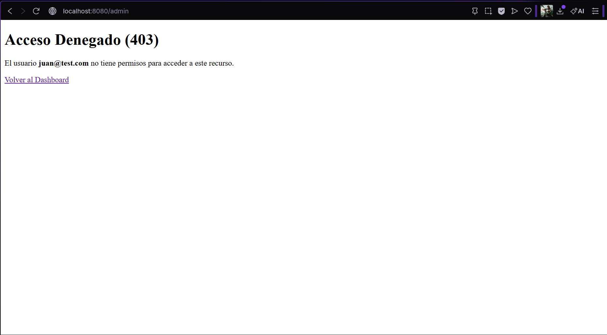
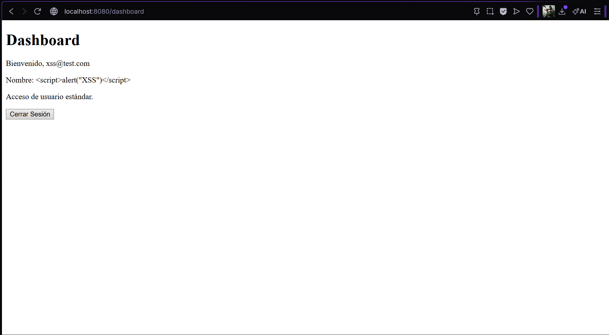
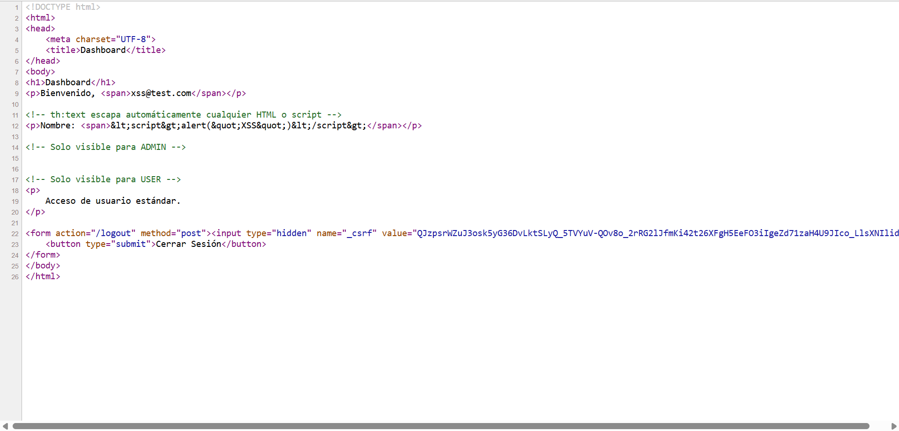
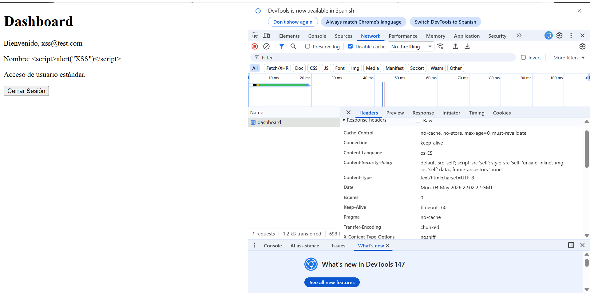
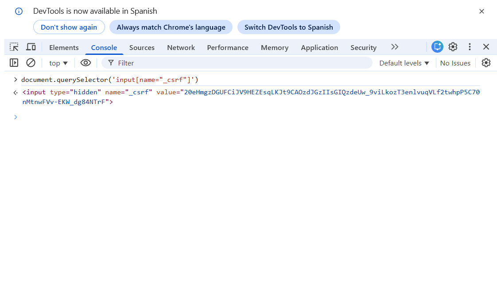

# Seguridad Web — Post-Contenido 2 Unidad 9

**Programación Web | Ingeniería de Sistemas | 2026**

Verificación activa de protecciones de seguridad implementadas con Spring Security 6:
autorización a nivel de método con @PreAuthorize, mitigación de XSS con Thymeleaf,
cabecera Content-Security-Policy y protección CSRF.

---

## Tecnologías utilizadas

- Java 17
- Spring Boot 3.3.5
- Spring Security 6
- Spring Data JPA + Hibernate
- MySQL 8
- Thymeleaf + thymeleaf-extras-springsecurity6
- BCryptPasswordEncoder (strength 12)
- Maven

---

## Requisitos previos

- Post-Contenido 1 completado y funcionando
- Java 17 o superior instalado
- MySQL corriendo en `localhost:3306`
- Maven (o usar el wrapper `./mvnw` incluido)

---

## Configuración de MySQL

```properties
spring.datasource.url=jdbc:mysql://localhost:3306/seguridad_db?createDatabaseIfNotExist=true&useSSL=false&serverTimezone=UTC
spring.datasource.username=root
spring.datasource.password=TU_PASSWORD
```

---

## Cómo ejecutar

```bash
git clone https://github.com/Abrahan07/ProWeb-Remolina-post2-u9.git
cd ProWeb-Remolina-post2-u9
./mvnw spring-boot:run
```

Abrir en el navegador: [http://localhost:8080](http://localhost:8080)

---

## Usuarios de prueba

| Nombre | Email | Contraseña | Rol |
|---|---|---|---|
| Juan Pérez | juan@test.com | 123456 | ROLE_USER |
| Administrador | admin@universidad.edu | admin123 | ROLE_ADMIN |
| `<script>alert("XSS")</script>` | xss@test.com | 123456 | ROLE_USER |

---

## Arquitectura del proyecto

```
src/main/java/com/universidad/seguridad/
├── config/
│   └── SecurityConfig.java         # SecurityFilterChain, BCrypt, CSP, AuthProvider
├── controller/
│   ├── AuthController.java         # Rutas login, registro, dashboard, admin
│   └── ErrorController.java        # Vista personalizada error 403
├── model/
│   └── Usuario.java                # Entidad JPA mapeada a tabla usuarios
├── repository/
│   └── UsuarioRepository.java      # JpaRepository con búsqueda por email
└── service/
    ├── UsuarioService.java          # @PreAuthorize en métodos de negocio
    └── UsuarioDetailsService.java   # Implementación de UserDetailsService
```

---

## Protecciones implementadas y verificadas

### 1. Autorización a nivel de método con @PreAuthorize

Se implementaron 4 métodos con distintas expresiones SpEL en `UsuarioService`:

```java
// Solo ADMIN puede listar todos los usuarios
@PreAuthorize("hasRole('ADMIN')")
public List<Usuario> listarTodos()

// ADMIN o el propio usuario pueden buscar por email
@PreAuthorize("hasRole('ADMIN') or #email == authentication.name")
public Optional<Usuario> buscarPorEmail(String email)

// Solo ADMIN puede cambiar roles
@PreAuthorize("hasRole('ADMIN')")
public void cambiarRol(Long id, String nuevoRol)

// Un usuario solo puede actualizar sus propios datos
@PreAuthorize("#usuario.email == authentication.name or hasRole('ADMIN')")
public void actualizarNombre(Usuario usuario)
```

**Prueba realizada:** Usuario con rol USER intentó acceder a `/admin`,
Spring Security interceptó la llamada a `listarTodos()` y mostró
la página de error 403 personalizada con el nombre del usuario autenticado.

---

### 2. Mitigación de XSS con Thymeleaf

Thymeleaf escapa automáticamente el contenido con `th:text`, convirtiendo
caracteres especiales HTML en entidades seguras antes de enviarlos al navegador.

**Payload utilizado:** `<script>alert("XSS")</script>`

**Prueba realizada:** Se registró un usuario con ese nombre como payload XSS.
Al iniciar sesión, el dashboard mostró el texto literal sin ejecutar ningún alert.
El código fuente confirmó el escapado correcto:

```html
<span>&lt;script&gt;alert(&quot;XSS&quot;)&lt;/script&gt;</span>
```

>  Nunca usar `th:utext` con datos ingresados por el usuario ya que inserta
> HTML sin escapar y permite XSS directo.

---

### 3. Cabecera Content-Security-Policy

Se configuró una política CSP en `SecurityConfig` que indica al navegador
qué fuentes de recursos son legítimas:

```
default-src 'self';
script-src 'self';
style-src 'self' 'unsafe-inline';
img-src 'self' data:;
frame-ancestors 'none'
```

**Prueba realizada:** Verificado en Chrome DevTools → Network → Response Headers
confirmando que el servidor envía la cabecera `Content-Security-Policy` correctamente.

---

### 4. Protección CSRF

Spring Security genera un token `_csrf` por sesión que Thymeleaf incluye
automáticamente en todos los formularios con `th:action`.

**Prueba realizada:** Se verificó desde la consola del navegador que el token
CSRF está activo en los formularios:

```javascript
document.querySelector('input[name="_csrf"]')
// Resultado: <input type="hidden" name="_csrf" value="a6fp7QTt...">
```

Cualquier petición POST sin este token es rechazada con `403 Forbidden`.

---

## Rutas de la aplicación

| Ruta | Acceso | Descripción |
|---|---|---|
| `/` | Público | Página principal |
| `/registro` | Público | Registro de nuevos usuarios |
| `/login` | Público | Formulario de inicio de sesión |
| `/dashboard` | Autenticado | Panel principal del usuario |
| `/admin` | Solo ADMIN | Panel de administración |
| `/error/403` | Autenticado | Página de acceso denegado |
| `/logout` | Autenticado | Cierre de sesión |

---

## Evidencia de funcionamiento

### @PreAuthorize — Error 403 personalizado



### XSS — Dashboard con texto literal escapado



### XSS — Código fuente con entidades HTML escapadas



### CSP — Cabecera en Chrome DevTools



### CSRF — Token activo en formulario



---
